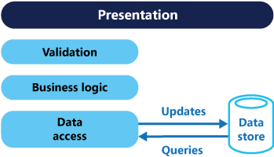

## Command and Query Responsibility Segregation (CQRS)

note:
Separate __read and update__ operations  
Performance, security, scalability
__Same business logic__ for all CRUD
Conflicts with simulatenous __collaborators__